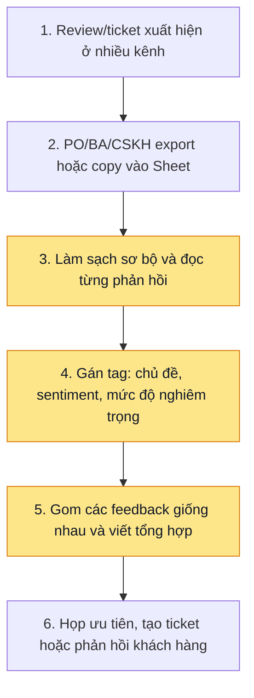
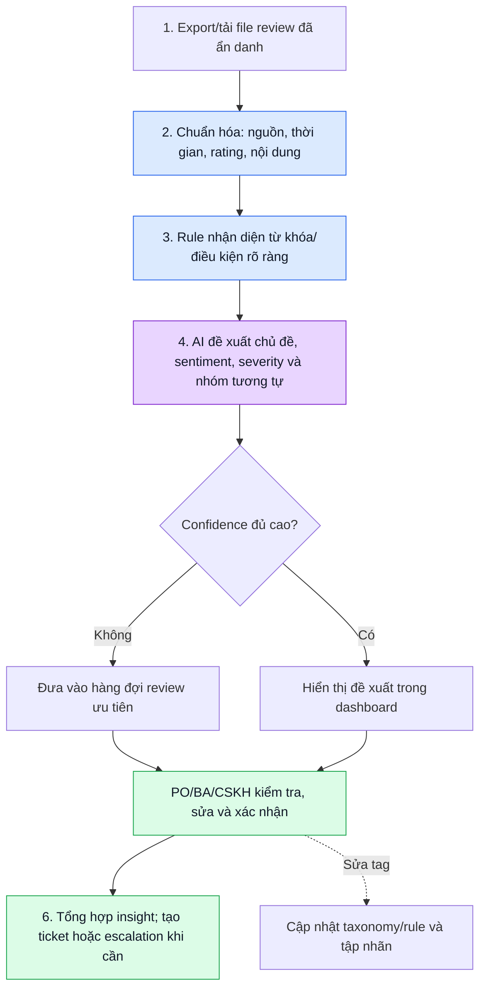

# Group Report — Day 02

## Thành viên nhóm

| STT | Họ và tên | Mã học viên | Vai trò trong nhóm |
|-----|-----------|-------------|--------------------|
| 1 | Nguyễn Bùi Anh Tuấn | 2A202601208 | Trưởng nhóm |
| 2 | Nguyễn Việt Anh | 2A202601144 | Thành viên nhóm |
| 3 | Nguyễn Ngọc Chi | 2A202602024 | Thành viên nhóm |
| 4 | Đào Chí Hiển | 2A202601066 | Thành viên nhóm |
| 5 | Trần Thanh Bình | 2A202601174 | Thành viên nhóm |

## 1. Nhật ký hội tụ

Nhóm thảo luận ba candidate problem có workflow và pain point đủ rõ. Bảng điểm dùng thang 1–5; đây là đánh giá của nhóm trong buổi lab, không phải kết quả khảo sát thị trường.

| Candidate | Actor & bottleneck | Pain có evidence | Impact đo được | Khả thi trong lab | Phù hợp AI | Nhóm hiểu domain | Tổng / 25 |
|---|---|---:|---:|---:|---:|---:|---:|
| Quản lý chi tiêu cá nhân thông minh | Sinh viên/người đi làm; nhập lại hóa đơn và phân loại thủ công vào cuối tháng | 5 | 4 | 4 | 4 | 4 | 21 |
| **Xử lý feedback/review khách hàng phân tán** | PO, BA, CSKH; đọc, lọc trùng và gán tag thủ công cho lượng review lớn từ nhiều kênh | 5 | 5 | 4 | 5 | 4 | **23** |
| Điều khiển IVI bằng giọng nói khi lái xe | Người lái xe; phải rời mắt khỏi đường để thao tác nhiều menu | 4 | 4 | 4 | 2 | 2 | 16 |

### Quyết định shortlist

Nhóm chọn **Xử lý feedback/review khách hàng phân tán** để đào sâu.

- PO, BA và CSKH thường phải gom review từ app store, mạng xã hội, form phản hồi hoặc ticket, rồi đọc và gán tag thủ công trước khi xác định vấn đề cần ưu tiên.
- Bài toán có đầu ra kiểm tra được: chủ đề, sentiment, mức độ nghiêm trọng và các phản hồi trùng/lặp. Người vận hành có thể review trên tập dữ liệu mẫu đã gán nhãn.
- AI phù hợp với bước ngôn ngữ lặp lại, trong khi quyết định ưu tiên và phản hồi khách hàng vẫn thuộc về con người.

Vì sao chưa chọn hai candidate còn lại:

- **Quản lý chi tiêu:** workflow rõ nhưng nhóm không có đủ ảnh hóa đơn đa dạng và dữ liệu đối chiếu để kiểm chứng chất lượng OCR trong lab. Bài toán cũng có yếu tố dữ liệu tài chính cá nhân cần xử lý thận trọng.
- **IVI:** có ý nghĩa an toàn cao, nhưng đòi hỏi ngữ cảnh xe, phần cứng, nhận dạng giọng nói ổn định và kiểm thử an toàn. Không phù hợp để validate bằng một pilot lab ngắn.

## 2. Quick validation và research

### Giả định cần kiểm chứng

Nhóm chưa có dữ liệu khảo sát định lượng riêng. Các con số dưới đây là **mục tiêu pilot**, không phải fact đã chứng minh. Trước khi mở rộng, cần dùng review/ticket đã được ẩn danh và phỏng vấn 3–5 người làm PO, BA hoặc CSKH.

| Giả định | Cách kiểm chứng nhanh | Tín hiệu cần quan sát |
|---|---|---|
| Feedback phân tán làm chậm việc nhận ra vấn đề lặp lại | Cho người tham gia xử lý cùng một batch review theo cách hiện tại | Thời gian gom, đọc, gán tag và số chủ đề bị phát hiện muộn |
| AI có thể hỗ trợ gán tag/chủ đề nhất quán | So sánh tag AI với nhãn do người vận hành thống nhất trên tập mẫu | Tỷ lệ đồng thuận; loại tag hay bị nhầm; thời gian phải sửa |
| Cần người review trước khi escalation | Đưa vào tập mẫu các phản hồi có từ khóa lỗi nghiêm trọng, hoàn tiền hoặc an toàn | Tỷ lệ phản hồi nghiêm trọng được giữ lại; false positive; lý do override |

### Research giải pháp có sẵn

| Nguồn / công cụ | Họ giải quyết phần nào? | Điểm mạnh | Khoảng trống / bài học cho nhóm |
|---|---|---|---|
| [Google Play Console — Ratings and reviews](https://support.google.com/googleplay/android-developer/answer/138230) | Đọc, lọc và trả lời review của ứng dụng trên Google Play | Cung cấp một kênh review và bộ lọc theo rating/ngày | Chỉ là một nguồn; nhóm vẫn cần chuẩn hóa dữ liệu và nhìn chủ đề xuyên nhiều kênh |
| [Zendesk — Ticket fields](https://support.zendesk.com/hc/en-us/articles/4408886167322-About-ticket-fields) | Gắn trường/tag có cấu trúc cho ticket | Tag chuẩn giúp báo cáo và phân công nhất quán | Việc đọc và gán tag ban đầu vẫn tốn công; taxonomy cần owner duy trì |
| [OpenAI — Text classification](https://platform.openai.com/docs/guides/classification) | Phân loại nội dung văn bản vào các nhãn đã định nghĩa | Phù hợp cho intent, sentiment hoặc mức độ nghiêm trọng khi có schema rõ | Kết quả cần confidence, ví dụ minh chứng và bước review; không tự ra quyết định product |

Research takeaway:

```text
Không cần xây một agent tự trả lời khách hàng. Workflow phù hợp hơn: chuẩn hóa feedback,
rule xử lý dấu hiệu rõ ràng, AI đề xuất tag/tóm tắt, rồi PO/BA/CSKH review trước khi ưu tiên hoặc escalation.
```

## 3. Workflow trước và sau

### Current state — gom và đọc thủ công



Bottleneck: bước 3–5. Người vận hành phải đổi ngữ cảnh giữa các kênh, đọc nhiều phản hồi gần giống nhau và gán tag không đồng đều; vì vậy tín hiệu về bug hoặc pain lặp lại có thể bị chìm.

### Future state — workflow hỗ trợ phân loại, có người duyệt



Fallback: nếu nội dung quá ngắn, mơ hồ, khác ngôn ngữ hoặc confidence thấp thì hệ thống không tự chốt tag mà đưa vào hàng đợi review. Các phản hồi có dấu hiệu bug nghiêm trọng, rủi ro an toàn, bảo mật hoặc yêu cầu hoàn tiền luôn cần người có trách nhiệm xác minh trước khi escalation.

| Chỉ số | Hiện trạng cần đo trong pilot | Mục tiêu pilot | Cách đo |
|---|---:|---:|---|
| Thời gian triage một batch feedback | Baseline trên cùng số review | Giảm ít nhất 50% | Đo từ lúc nhận file đến lúc có bản tổng hợp đã được duyệt |
| Độ đồng thuận tag với người review | Chưa có baseline | ≥ 80% trên taxonomy đã thống nhất | So sánh tag cuối của người review với đề xuất AI/rule |
| Recall phản hồi nghiêm trọng | Chưa có baseline | ≥ 90% trên tập nhãn kiểm thử | Đối chiếu các feedback severity cao đã được người review xác định |
| Tỷ lệ đề xuất cần sửa | Chưa có baseline | Theo dõi, không đặt mục tiêu giả định | Log các tag/chủ đề bị sửa và lý do sửa |

## 4. Problem Statement v0

| Field | Nội dung |
|---|---|
| **Actor** | PO, BA và nhân viên CSKH phụ trách theo dõi phản hồi khách hàng cho sản phẩm số. |
| **Workflow** | Export/copy review từ nhiều kênh → đưa vào Sheet/tool → đọc từng phản hồi → gán tag chủ đề/sentiment/severity → gom nhóm → ưu tiên hoặc tạo ticket. |
| **Bottleneck** | Đọc, so sánh, lọc trùng và gán tag thủ công cho lượng feedback lớn từ nhiều nguồn tốn thời gian và không nhất quán. |
| **Impact** | Bug hoặc pain lặp lại có thể bị phát hiện muộn; báo cáo insight thiếu nhất quán; team product khó ưu tiên dựa trên tín hiệu khách hàng. |
| **Success metric** | Giảm ít nhất 50% thời gian triage batch; đạt ≥ 80% đồng thuận tag với người review; giữ được ≥ 90% feedback nghiêm trọng trên tập kiểm thử. |
| **Boundary** | Chỉ xử lý dữ liệu feedback đã được ẩn danh và được phép dùng cho pilot; không tự gửi trả lời, không tự tạo/đóng ticket production, không thay người phụ trách quyết định severity hay roadmap. |

## 5. So sánh No AI / Rule / Workflow / Agent

| Mức | Phương án | Phần giải được | Hạn chế / rủi ro | Chọn? |
|---|---|---|---|---|
| **No AI** | Sheet chung, taxonomy tag và quy trình review thủ công | Có nơi tập trung dữ liệu và báo cáo cơ bản | Vẫn phải đọc/gán tag từng phản hồi; khó mở rộng khi volume tăng | Không đủ |
| **Rule** | Từ khóa, regex, rating thấp và mapping nguồn → tag/severity | Nhanh, rẻ, dễ giải thích với tín hiệu rõ như “crash” hoặc rating 1 sao | Bỏ sót cách diễn đạt mới, mỉa mai, ngữ cảnh và nhiều vấn đề trong một review | Dùng bổ trợ |
| **Workflow** | Import → chuẩn hóa → rule → AI đề xuất tag/nhóm/tóm tắt → người dùng duyệt → xuất insight hoặc tạo ticket | Tự động hóa các bước lặp lại, giữ được human boundary cho quyết định quan trọng | AI có thể gán sai hoặc bỏ sót; cần confidence, audit log và review | **Chọn** |
| **Agent** | Tự lấy dữ liệu từ mọi kênh, tự hỏi thêm, tự ưu tiên roadmap và tự trả lời/escalate | Có thể hữu ích khi quyền truy cập và policy đã chín muồi | Scope, quyền dữ liệu, rủi ro phản hồi sai và khó kiểm soát quá lớn cho pilot | Không chọn |

Mức được chọn:

```text
Workflow: rule cho tín hiệu rõ ràng + AI đề xuất tag/nhóm/tóm tắt + PO/BA/CSKH xác nhận trước khi tạo hành động.
```

Lý do: đường đi có thể chuẩn hóa và đầu ra có schema rõ. AI không được tự đánh dấu một feedback là incident, tự tạo ticket production, tự thay đổi ưu tiên roadmap hoặc tự trả lời khách hàng.

## 6. Problem Statement v1

| Field | Nội dung |
|---|---|
| **Actor** | PO, BA và CSKH cần hiểu nhanh các phản hồi khách hàng phân tán để đưa tín hiệu vào quyết định sản phẩm. |
| **Workflow** | Export feedback đã ẩn danh từ các kênh được chọn → chuẩn hóa → rule kiểm tra tín hiệu rõ → AI đề xuất chủ đề, sentiment, severity và cụm phản hồi tương tự → người phụ trách review/sửa → tổng hợp insight, tạo ticket hoặc escalation. |
| **Bottleneck** | Việc đọc từng phản hồi, gán tag và gom các ý giống nhau thủ công làm chậm triage và tạo taxonomy không nhất quán giữa người xử lý/kênh dữ liệu. |
| **Impact** | Tín hiệu về bug, yêu cầu tính năng hoặc pain lặp lại đến product team chậm hoặc thiếu bối cảnh, làm giảm chất lượng ưu tiên. |
| **Success metric** | Trên tập pilot: thời gian triage batch giảm ≥ 50%; tag cuối đồng thuận ≥ 80% với người review; recall feedback nghiêm trọng ≥ 90%; ghi nhận tỷ lệ và lý do sửa đề xuất để cải thiện taxonomy. |
| **AI intervention point** | Sau chuẩn hóa và rule: AI đề xuất tối đa các trường chủ đề, sentiment, severity, bản tóm tắt ngắn và nhóm phản hồi tương tự; luôn kèm confidence/lý do. |
| **Mức chọn** | **Workflow**. Rule xử lý dấu hiệu xác định; AI hỗ trợ đọc hiểu và tổng hợp; PO/BA/CSKH kiểm tra trước mọi hành động tiếp theo. |
| **Human boundary & rủi ro** | Người phụ trách xác nhận severity, nhãn cuối, nội dung insight và quyết định tạo ticket/escalation. Rủi ro: dữ liệu nhạy cảm, ngôn ngữ mơ hồ, hallucination, thiên lệch theo rating hoặc bỏ sót feedback hiếm nhưng nghiêm trọng. Fallback là đưa vào hàng đợi review thủ công. |
| **Ngoài phạm vi** | Không crawl dữ liệu riêng tư; không tự động gửi reply; không kết nối/tác động trực tiếp Jira, CRM hoặc hệ thống production trong pilot; không tự quyết roadmap. |

## 7. Quyết định cuối

```text
GO — pilot scope nhỏ với feedback đã ẩn danh, từ tối đa hai nguồn và có người phụ trách review.
```

Pilot nhỏ nhất:

1. Chuẩn bị 200–300 feedback/ticket đã được phép sử dụng và ẩn danh, từ một hoặc hai nguồn; thống nhất taxonomy 5–8 chủ đề, sentiment và 3 mức severity.
2. Hai người review độc lập một phần mẫu để tạo nhãn tham chiếu và xử lý bất đồng trước khi đánh giá AI.
3. Chạy flow import → chuẩn hóa → rule → AI đề xuất → review; không thực hiện bất kỳ hành động tự động nào trên hệ thống production.
4. Log thời gian triage, tag bị sửa, feedback severity cao bị bỏ sót và lý do override; so sánh với cách làm thủ công trên cùng batch.

Điều kiện mở rộng / hạ scope:

- Nếu độ đồng thuận tag dưới 80%, hạ scope về taxonomy ít nhãn hơn hoặc chỉ dùng rule + hàng đợi review thủ công.
- Nếu recall feedback nghiêm trọng dưới 90%, bỏ tự động gom/đánh dấu severity và yêu cầu review toàn bộ feedback có rating thấp hoặc từ khóa rủi ro.
- Chỉ kết nối thêm nguồn dữ liệu hoặc Jira/CRM sau khi có consent, đánh giá quyền truy cập và chứng minh được giá trị của pilot.
